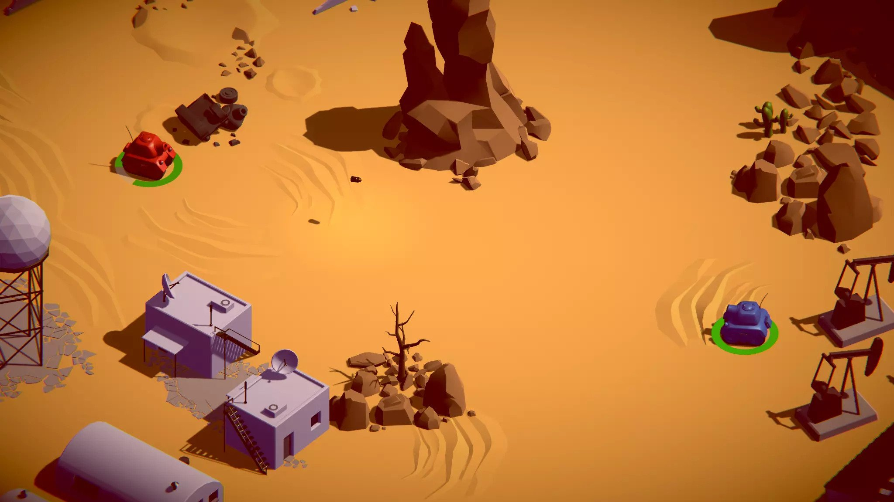

## Tanks Game: A 3D Tank Shooter for Two Players
This is a 3D tank shooter game designed for two players using a single keyboard. It emphasizes simple and intuitive gameplay mechanics while showcasing core game development skills like UI integration, game architecture, and audio mixing.

# Key Features:

2-Player Local Multiplayer: Challenge a friend to a head-to-head tank battle!
Simple Controls: Intuitive controls on a single keyboard allow for easy pick-up-and-play action.

# Development Process:

This project began by following a series of online tutorials to establish a strong foundation. Will want to expanded upon this base by adding unique features and completely revamping the game mode. This iterative process aimed to create a more engaging and content-rich gameplay experience was still be in bucket list.

# Project Status:

This repository currently provides the source code only.  To play the game, you will need to download and install the latest version of Unity and then export the project into a playable game.

# Screenshots:

 
  
  
  
 
  

